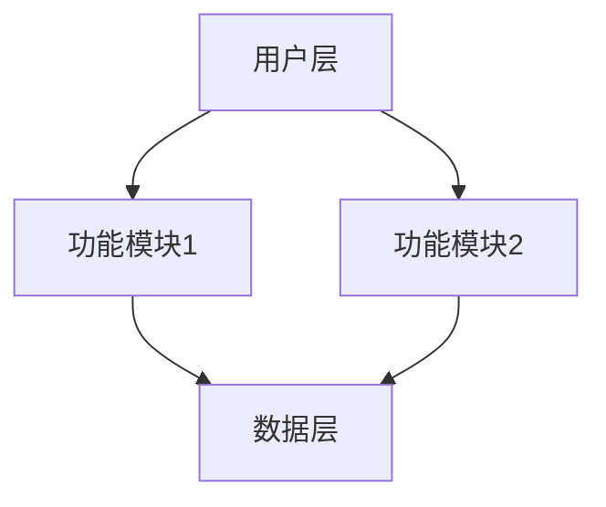
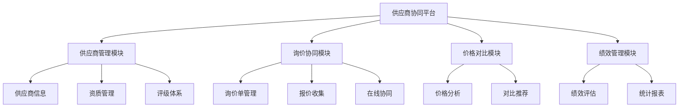
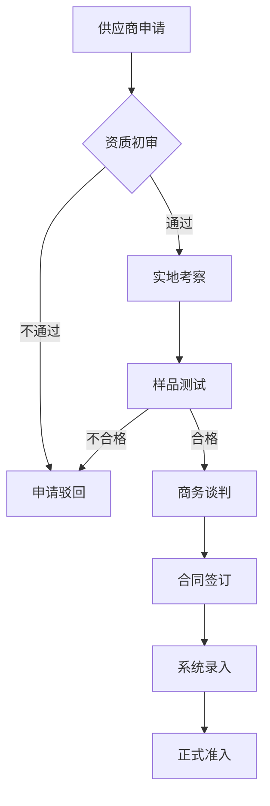

# 第二阶段：产品规划

## 阶段目标

基于需求调研结果制定产品架构、功能模块和优先级规划，为PRD文档撰写提供清晰的结构框架。

## 前置条件

- 已完成需求调研阶段
- 存在 `.claude/prd/{功能名}/research.md` 文件
- 需求调研报告已获得用户认可

## 工作内容

### 1. 基于需求调研文档制定架构方案

- 分析需求调研中识别的核心问题
- 提炼产品功能的核心价值主张
- 规划产品的整体架构和模块划分
- 设计功能模块之间的关系和依赖

### 2. 创建产品规划文档

创建 `.claude/prd/{功能名}/architecture.md`，包含以下内容：

#### 2.1 产品整体架构

**系统架构图**：
- 使用Mermaid图表展示产品架构
- 清晰标识各功能模块及其关系
- 说明数据流向和交互关系



**功能模块划分**：
- 按业务领域划分功能模块
- 说明每个模块的核心职责
- 定义模块边界和接口

**数据流向图**：
- 展示关键业务数据的流转路径
- 标识数据来源和目的地
- 说明数据转换和处理逻辑

#### 2.2 功能清单与优先级

| 功能模块 | 核心功能 | 优先级 | 复杂度 | 依赖关系 | 预估工作量 |
|----------|----------|--------|--------|----------|------------|
| 供应商管理 | 信息管理、评级、审核 | P0 | 中 | 无 | 2周 |
| 询价协同 | 在线询价、报价收集 | P1 | 高 | 供应商管理 | 3周 |
| 价格对比 | 价格分析、优选推荐 | P1 | 中 | 询价协同 | 1周 |
| 绩效管理 | 评估统计、报表生成 | P2 | 中 | 供应商管理 | 2周 |

**优先级说明**：
- **P0（核心功能）**：必须实现，是产品的基础功能
- **P1（重要功能）**：高优先级，显著提升用户价值
- **P2（增强功能）**：中等优先级，锦上添花的功能
- **P3（扩展功能）**：低优先级，未来可考虑的功能

**复杂度评估**：
- **低**：功能简单，实现直接
- **中**：功能适中，需要一定设计
- **高**：功能复杂，需要深入设计和多轮迭代

#### 2.3 用户体验设计

**核心流程**：

针对每个核心业务场景，设计用户操作流程：

1. **供应商准入流程**
   ```mermaid
   graph TD
       A[供应商申请] --> B[资质审核]
       B -->|通过| C[实地考察]
       B -->|不通过| D[申请驳回]
       C --> E[样品测试]
       E -->|合格| F[商务谈判]
       E -->|不合格| D
       F --> G[合同签订]
       G --> H[系统录入]
       H --> I[正式准入]
   ```

2. **询价协同流程**
   ```mermaid
   sequenceDiagram
       participant P as 采购专员
       participant S as 采购系统
       participant V1 as 供应商A
       participant V2 as 供应商B

       P->>S: 发起询价申请
       S->>V1: 推送询价单
       S->>V2: 推送询价单
       V1->>S: 提交报价
       V2->>S: 提交报价
       S->>P: 价格对比分析
       P->>S: 选择最优方案
   ```

**界面架构**：
- 页面结构和导航设计
- 关键页面的布局规划
- 交互元素的组织方式

**交互原则**：
- 操作流程要简洁直观
- 关键操作要有明确反馈
- 异常情况要有友好提示
- 支持常用操作的快捷方式

### 3. 迭代计划

基于功能优先级制定版本迭代计划：

| 版本 | 时间 | 核心功能 | 业务价值 |
|------|------|----------|----------|
| V1.0 | 2周  | 供应商信息管理、评级体系 | 供应商信息统一化，评估标准化 |
| V1.1 | 3周  | 询价协同、价格对比 | 采购效率提升30%，成本降低15% |
| V1.2 | 2周  | 绩效管理、统计报表 | 数据驱动决策，供应商管理精细化 |

## 输出标准

### 文档结构

```markdown
# {功能名}产品规划文档

## 1. 产品整体架构
### 1.1 系统架构图
### 1.2 功能模块划分
### 1.3 数据流向图

## 2. 功能清单与优先级
### 2.1 功能列表
### 2.2 优先级说明
### 2.3 复杂度评估
### 2.4 依赖关系分析

## 3. 用户体验设计
### 3.1 核心业务流程
### 3.2 界面架构
### 3.3 交互原则

## 4. 版本迭代计划
### 4.1 V1.0 MVP版本
### 4.2 V1.1 增强版本
### 4.3 V1.2 完善版本

## 5. 设计原则
### 5.1 模块化设计
### 5.2 可扩展性设计
### 5.3 用户体验优先

## 6. 集成方案
### 6.1 现有系统集成
### 6.2 第三方系统集成
### 6.3 数据同步方案
```

## 设计原则

### 模块化清晰

- 功能模块职责单一，边界清晰
- 模块间低耦合，高内聚
- 支持模块的独立开发和测试

### 可扩展性

- 预留扩展接口和钩子
- 支持功能的平滑升级
- 便于新功能的快速集成

### 用户体验优先

- 操作流程简洁高效
- 界面布局清晰合理
- 交互反馈及时准确
- 异常处理友好贴心

### 敏捷迭代

- 功能原子化，可独立交付
- 每个迭代都有明确的业务价值
- 支持快速反馈和调整
- 降低交付风险

## 质量检查清单

- [ ] 产品架构是否清晰和完整
- [ ] 功能模块划分是否合理
- [ ] 优先级排序是否准确
- [ ] 用户体验设计是否充分
- [ ] 迭代计划是否可行
- [ ] 是否考虑了可扩展性
- [ ] 是否符合敏捷开发原则
- [ ] 是否与需求调研结果一致

## 完成确认

当产品规划文档创建完成后，我会：

1. 向您展示产品架构和功能规划
2. 说明功能优先级和迭代计划
3. 征求您对产品规划的意见和建议
4. 确认产品规划是否满足业务需求
5. 等待您的明确认可后进入下一阶段

## 注意事项

- 产品规划要基于需求调研的结果
- 要考虑现有系统的架构和约束
- 要平衡业务价值和实现复杂度
- 要符合敏捷开发的理念
- 要为后续PRD撰写提供清晰框架

## 示例片段

### 产品整体架构示例



### 功能清单示例

| 功能模块 | 核心功能 | 优先级 | 复杂度 | 依赖关系 | 预估工作量 |
|----------|----------|--------|--------|----------|------------|
| 供应商管理 | 信息管理、资质审核、评级体系 | P0 | 中 | 无 | 2周 |
| 询价协同 | 询价单管理、报价收集、在线协同 | P1 | 高 | 供应商管理 | 3周 |
| 价格对比 | 价格分析、对比推荐、历史追溯 | P1 | 中 | 询价协同 | 1周 |
| 绩效管理 | 绩效评估、统计分析、报表生成 | P2 | 中 | 供应商管理 | 2周 |

### 核心流程示例

**供应商准入流程**：



**流程说明**：

1. **供应商申请**：供应商提交基本信息和资质材料
2. **资质初审**：采购部门审核资质材料的完整性和有效性
3. **实地考察**：通过初审后安排实地考察，评估生产能力
4. **样品测试**：提供样品进行质量检测
5. **商务谈判**：样品合格后进行价格和合作条款谈判
6. **合同签订**：达成一致后签订供应合同
7. **系统录入**：将供应商信息录入系统
8. **正式准入**：供应商正式纳入合格供应商库

## 推进到下一阶段

当产品规划完成并获得用户认可后，使用以下方式自然推进：

"基于现有系统的功能增强架构已规划完成。您觉得这个方案能有效提升供应链效率吗？如果认可，我可以开始按照标准PRD结构撰写详细需求文档"
