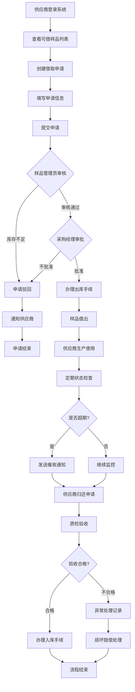
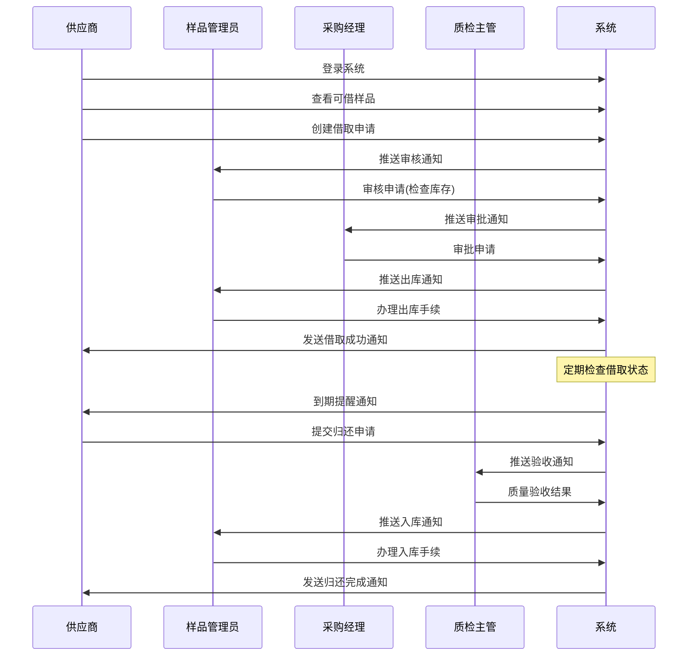
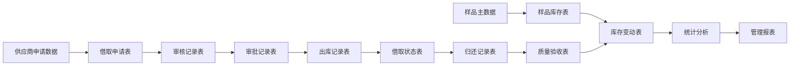
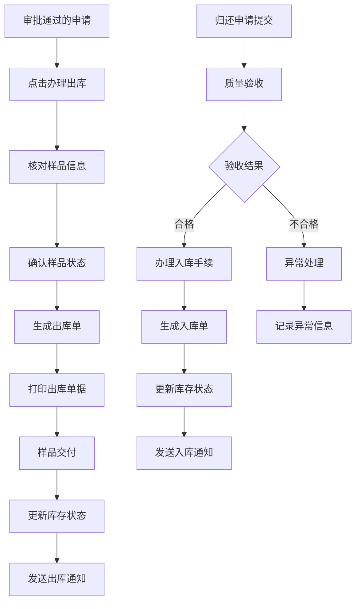
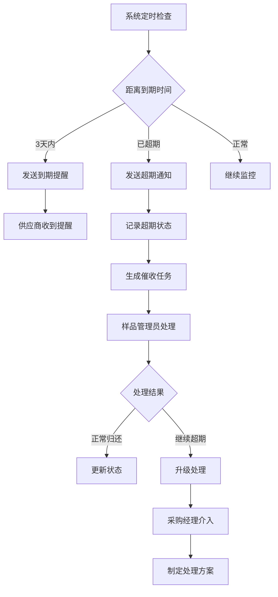
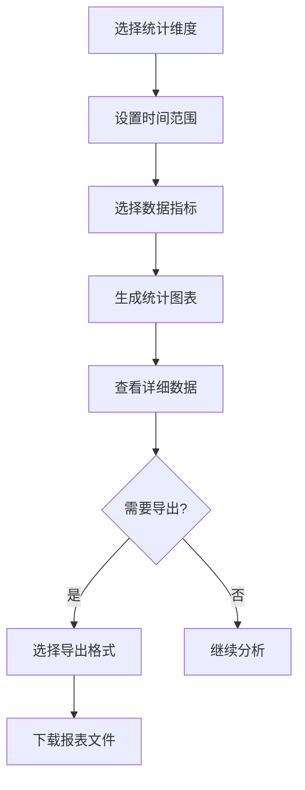
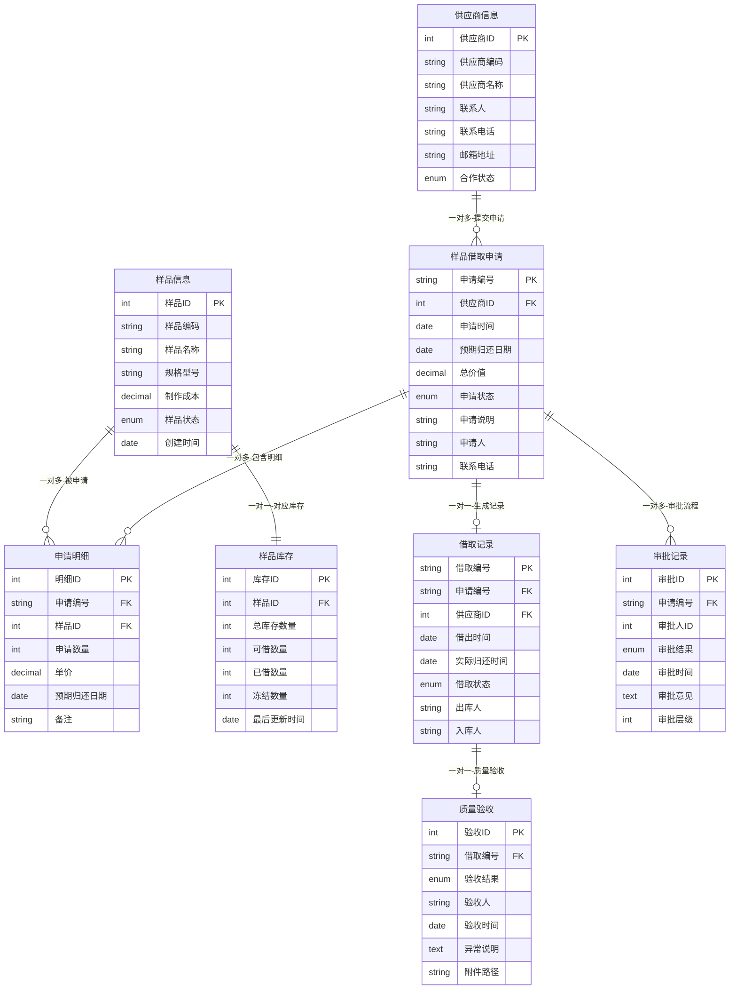

# 供应链系统PRD：供应商样品借取管理系统 V1.0

## 1. 版本迭代规划
| 版本 | 时间 | 核心功能 | 业务价值 |
|------|------|----------|----------|
| V1.0 | 2周  | 样品借取申请、审批流程、基础出入库 | 建立标准化借取流程，提升管理效率50% |
| V1.1 | 3周  | 质量验收、超期提醒、基础报表 | 完善质量控制，降低样品损失率至1% |
| V1.2 | 4周  | 高级分析、移动端支持、批量操作 | 提升用户体验，支持移动办公 |

## 2. 业务背景与目标
### 2.1 项目背景
- 当前供应商样品管理缺乏系统化支持，借取记录分散在Excel表格中，查询困难
- 样品借取流程不规范，缺乏标准化的审批和归还机制，导致样品丢失率高达5%
- 无法实时跟踪样品状态，影响生产计划安排和成本控制
- 业务量增长30%，现有人工管理模式已无法满足效率要求，急需数字化升级

### 2.2 核心用户与场景
| 角色 | 职责 | 使用场景 | 关键痛点 |
|------|------|----------|----------|
| 供应商 | 样品借取申请、按时归还 | 新订单生产前借取参考样品 | 申请流程繁琐，不了解库存状态 |
| 样品管理员 | 样品库存管理、借取审核 | 日常样品出入库管理、状态跟踪 | 手工记录工作量大，难以跟踪超期 |
| 采购经理 | 样品借取政策制定、重要申请审批 | 高价值样品审批、供应商绩效评估 | 缺乏全面数据分析，决策依据不足 |
| 质检主管 | 样品质量标准制定、归还验收 | 制定质量要求、验收归还样品 | 质量标准不统一，缺乏系统记录 |

### 2.3 业务目标
- **效率提升目标**：样品借取申请处理时间从24小时缩短至4小时，查询效率提升80%
- **成本控制目标**：样品丢失率从5%降低至1%以内，超期归还率控制在5%以下
- **质量改善目标**：建立标准化质量验收流程，归还合格率达95%以上
- **管理规范目标**：实现100%电子化管理，建立完整的样品生命周期追溯体系

## 3. 业务名词
| 业务名词 | 名词说明 | 应用场景 |
|----------|----------|----------|
| 样品借取申请 | 供应商向企业申请借用样品进行生产参考的正式申请单据 | 申请创建、审核审批 |
| 可借库存 | 样品实物库存中可供外借的数量，扣除已借出和冻结部分 | 库存查询、申请校验 |
| 借取期限 | 样品允许借用的最长时间，默认30天，最长不超过60天 | 申请审批、超期监控 |
| 质量验收 | 样品归还时对其完好性、清洁度等质量状况的检查确认 | 归还处理、异常记录 |
| 超期样品 | 超过约定归还期限仍未归还的样品 | 催收提醒、异常处理 |
| 样品冻结 | 因质量问题或争议暂时不可借出的样品状态 | 库存管理、质量控制 |
| 借取额度 | 单个供应商同时可借用样品的最大数量限制 | 申请校验、风险控制 |
| 样品成本 | 样品的制作成本，用于损坏赔偿和价值评估 | 审批依据、损失核算 |

## 4. 流程图
### 4.1 业务流程图

**流程说明**：
1. **申请阶段**：供应商在系统中选择样品，填写借取申请，说明用途和归还期限
2. **审核阶段**：样品管理员验证库存充足性，采购经理根据价值和政策进行审批
3. **借用阶段**：审批通过后办理出库，样品交付供应商使用
4. **监控阶段**：系统自动跟踪借取状态，超期自动发送催收通知
5. **归还阶段**：供应商提交归还申请，质检验收后办理入库手续
6. **异常处理**：处理样品损坏、丢失等异常情况，记录责任和损失

### 4.2 系统流程图

### 4.3 数据流程图

## 5. 功能需求详述与界面设计
### 5.1 样品借取申请管理
**功能概述**：提供供应商样品借取申请的创建、提交、修改和撤销功能，支持多样品批量申请

**用户故事**：作为供应商，我希望能够快速查看可借样品并提交借取申请，以便高效获取生产参考样品

**页面布局**：

> 📋 **提示**：粘贴样品借取申请页面原型图

**界面及交互说明**：

##### 5.1.1 页面说明
供应商登录系统后，点击一级菜单"样品管理" --- 二级菜单"借取申请" --- 三级菜单"新建申请"进入该页面

##### 5.1.2 基本信息区
| 字段名称 | 组件 | 提示文本 | 字段说明 |
|----------|------|----------|----------|
| 供应商名称 | 文本显示 | - | 1. 根据登录用户自动显示 2. 不可编辑，灰色显示 |
| 联系人 | 文本显示 | - | 1. 显示主联系人姓名 2. 从供应商信息自动获取 |
| 联系电话 | 文本显示 | - | 1. 显示主联系人手机号 2. 格式：138****8888 |
| 申请时间 | 文本显示 | - | 1. 系统当前时间 2. 格式：2024-01-15 14:30 |

##### 5.1.3 样品选择区
| 字段名称 | 组件 | 提示文本 | 字段说明 |
|----------|------|----------|----------|
| 样品搜索 | 搜索框 | 请输入样品名称或编码 | 1. 支持模糊搜索 2. 输入2字符后显示候选项 |
| 样品名称 | 下拉选择 | 请选择样品 | 1. 显示可借样品列表 2. 显示格式：样品名称(可借数量) |
| 申请数量 | 数字输入 | 请输入数量 | 1. 必须大于0的整数 2. 不能超过可借数量 |
| 预期归还日期 | 日期选择 | 请选择日期 | 1. 默认30天后 2. 最长不超过60天 |

##### 5.1.4 样品列表明细说明
| 字段名称 | 字段说明 |
|----------|----------|
| 样品编码 | 系统自动生成的唯一标识，格式：SP+8位数字 |
| 样品名称 | 样品完整名称，包含规格信息 |
| 当前库存 | 样品实物库存总数 |
| 可借数量 | 扣除已借出和冻结后的可借用数量 |
| 申请数量 | 本次申请借取的数量 |
| 样品成本 | 单个样品的制作成本，用于风险评估 |
| 预期归还 | 本批次样品的预期归还日期 |

##### 5.1.5 操作说明
| 操作项 | 说明 |
|--------|------|
| 添加样品 | 1. 用户点击【添加样品】按钮，弹出样品选择对话框 2. 可多选样品，批量添加到申请列表 3. 自动校验库存数量，不足时给出提示 |
| 删除样品 | 1. 用户点击样品行的【删除】按钮 2. 确认删除后从申请列表中移除 3. 至少保留一个样品才能提交申请 |
| 修改数量 | 1. 直接在申请数量列输入框中修改 2. 实时校验不能超过可借数量 3. 修改后自动计算总价值 |
| 保存草稿 | 1. 用户点击【保存草稿】按钮，保存当前申请信息 2. 状态为"草稿"，可继续编辑 3. 草稿7天后自动清理 |
| 提交申请 | 1. 用户点击【提交申请】按钮，提交正式申请 2. 提交前校验必填字段和业务规则 3. 提交后状态变为"待审核"，不可修改 |

**业务规则**：
- **数量限制规则**：单次申请数量不超过可借库存，同一供应商总借取数量不超过设定额度
- **期限控制规则**：借取期限默认30天，最长不超过60天，超期自动发送提醒
- **审批规则**：总价值500元以下样品管理员审核即可，500元以上需采购经理审批
- **状态流转规则**：草稿→待审核→审核中→已批准→已驳回，每个状态有对应的操作权限

**验收标准**：
| 验收项目 | 验收标准 | 测试方法 |
|----------|----------|----------|
| 申请创建 | 3分钟内完成单个样品申请，5分钟内完成多样品申请 | 功能测试 |
| 数据校验 | 实时校验库存数量、借取额度等业务规则 | 边界值测试 |
| 用户体验 | 操作流程不超过5步，错误提示清晰明确 | 可用性测试 |

### 5.2 审核审批管理
**功能概述**：为样品管理员和采购经理提供借取申请的审核审批功能，支持批量处理和审批历史查询

**用户故事**：作为样品管理员，我希望能够快速审核借取申请并检查库存状态，以便及时处理供应商需求

**页面布局**：

> 📋 **提示**：粘贴审核管理页面原型图

**界面及交互说明**：

##### 5.2.1 页面说明
样品管理员登录系统后，点击一级菜单"样品管理" --- 二级菜单"审核管理" --- 进入审核待办页面

##### 5.2.2 筛选查询区
| 字段名称 | 组件 | 提示文本 | 字段说明 |
|----------|------|----------|----------|
| 申请状态 | 下拉列表 | 请选择 | 1. 选项：全部、待审核、审核中、已批准、已驳回 2. 默认显示：待审核 |
| 申请日期 | 日期范围 | 请选择日期范围 | 1. 支持快捷选择：今天、本周、本月 2. 默认显示最近7天 |
| 供应商名称 | 搜索框 | 请输入供应商名称 | 1. 支持模糊搜索 2. 下拉显示匹配结果 |
| 申请编号 | 输入框 | 请输入申请编号 | 1. 支持精确匹配 2. 格式：BT+年月日+流水号 |

##### 5.2.3 列表明细说明
| 字段名称 | 字段说明 |
|----------|----------|
| 申请编号 | 系统自动生成，格式：BT+YYYYMMDD+001 |
| 供应商名称 | 申请供应商的完整企业名称 |
| 申请人 | 提交申请的联系人姓名 |
| 申请时间 | 申请提交的具体时间，精确到分钟 |
| 样品数量 | 申请样品的种类数和总件数，格式：3种/5件 |
| 总价值 | 申请样品的总制作成本，用于审批参考 |
| 预期归还 | 申请中填写的预期归还日期 |
| 当前状态 | 申请的当前处理状态，用颜色标识 |
| 库存状态 | 显示库存是否充足，✓充足 ⚠️紧张 ✗不足 |

##### 5.2.4 操作说明
| 操作项 | 说明 |
|--------|------|
| 查看详情 | 1. 用户点击【查看详情】按钮，弹出申请详情页面 2. 显示完整的申请信息、样品明细、申请说明 3. 显示库存状态和历史借取记录 |
| 审核通过 | 1. 样品管理员点击【审核通过】按钮 2. 系统校验库存充足性和业务规则 3. 通过后状态变为"审核中"，推送给采购经理审批 |
| 审核驳回 | 1. 样品管理员点击【驳回】按钮，弹出驳回原因输入框 2. 必须填写驳回原因，如库存不足、申请不合理等 3. 驳回后状态变为"已驳回"，通知供应商 |
| 批量审核 | 1. 用户勾选多个申请，点击【批量审核】按钮 2. 支持批量通过或批量驳回 3. 系统逐一校验，失败的给出具体原因 |
| 审批通过 | 1. 采购经理点击【审批通过】按钮 2. 高价值样品需要填写审批意见 3. 通过后状态变为"已批准"，可办理出库 |
| 审批驳回 | 1. 采购经理点击【驳回】按钮，填写驳回理由 2. 驳回后退回到样品管理员，可重新审核 3. 系统记录完整的审批流程 |

**业务规则**：
- **权限控制规则**：样品管理员只能审核，采购经理可审批，不能越权操作
- **库存检查规则**：审核时实时检查库存状态，库存不足自动驳回
- **时效性规则**：申请超过3个工作日未处理，系统自动催办
- **审批层级规则**：根据样品总价值自动确定审批层级和审批人

**验收标准**：
| 验收项目 | 验收标准 | 测试方法 |
|----------|----------|----------|
| 审核效率 | 单个申请审核时间不超过2分钟 | 效率测试 |
| 批量处理 | 支持最多20个申请的批量审核 | 压力测试 |
| 审批准确性 | 审批规则执行正确率100% | 规则测试 |

### 5.3 样品出入库管理
**功能概述**：提供样品的出库、入库操作管理，实时更新库存状态，生成出入库单据

**用户故事**：作为样品管理员，我希望能够快速办理样品出入库手续，确保库存数据准确无误

**交互流程**：

**业务规则**：
- **出库规则**：只有审批通过的申请才能办理出库，出库时必须核对样品实物
- **入库规则**：归还样品必须经过质量验收，合格后才能入库
- **库存更新规则**：出入库操作立即更新库存数据，确保数据实时性
- **单据管理规则**：每次出入库都生成正式单据，支持打印和电子存档

### 5.4 超期提醒与异常处理
**功能概述**：自动监控样品借取状态，提供超期预警、催收通知和异常情况处理

**用户故事**：作为样品管理员，我希望系统能够自动提醒超期样品，帮助我及时催收

**交互流程**：

**业务规则**：
- **提醒机制**：到期前3天、1天各提醒一次，超期后每3天提醒一次
- **升级机制**：超期7天自动升级，采购经理介入处理
- **责任追究**：超期30天启动赔偿程序，记录供应商信用
- **异常记录**：所有异常情况都要详细记录，形成处理档案

### 5.5 统计分析报表
**功能概述**：提供样品借取的多维度统计分析，支持报表导出和数据可视化

**用户故事**：作为采购经理，我希望能够查看样品借取的统计分析，以便制定更好的管理策略

**交互流程**：

**功能特点**：
- **多维度分析**：按供应商、样品类型、时间等维度统计
- **可视化图表**：柱状图、饼图、趋势图等多种展示方式
- **实时数据**：统计数据实时更新，确保分析准确性
- **报表导出**：支持Excel、PDF等格式导出

## 6. 数据模型
### 6.1 核心实体定义
| 实体名称 | 业务含义 | 核心属性 | 数据类型 | 业务约束 |
|----------|----------|----------|----------|----------|
| 样品借取申请 | 供应商提交的样品借取申请单 | 申请编号、供应商ID、申请状态、总价值 | VARCHAR、INT、ENUM、DECIMAL | 申请编号唯一，状态流转有序 |
| 申请明细 | 申请中的具体样品信息 | 样品ID、申请数量、预期归还日期 | INT、INT、DATE | 数量必须大于0 |
| 样品库存 | 样品的库存信息 | 样品编码、总库存、可借库存、冻结库存 | VARCHAR、INT、INT、INT | 库存数量不能为负 |
| 借取记录 | 样品的借出归还记录 | 借取编号、借出时间、归还时间、状态 | VARCHAR、DATETIME、DATETIME、ENUM | 借出时间必须早于归还时间 |
| 质量验收 | 样品归还时的质量检查记录 | 验收结果、验收人、验收时间、异常说明 | ENUM、VARCHAR、DATETIME、TEXT | 验收人不能为空 |

### 6.2 实体关系图

**关系说明**：
- **样品借取申请 → 申请明细**：一对多关系，一个申请可包含多个样品明细
- **样品信息 → 样品库存**：一对一关系，每个样品有唯一对应的库存记录
- **样品借取申请 → 借取记录**：一对一关系，审批通过后生成借取记录
- **借取记录 → 质量验收**：一对一关系，归还时必须进行质量验收
- **供应商信息 → 样品借取申请**：一对多关系，一个供应商可有多个申请
- **样品借取申请 → 审批记录**：一对多关系，支持多级审批流程

### 6.3 关键字段说明

#### 申请状态枚举
- **草稿(DRAFT)**：用户保存但未提交的申请
- **待审核(PENDING_REVIEW)**：已提交等待样品管理员审核
- **审核中(REVIEWING)**：审核通过等待采购经理审批
- **已批准(APPROVED)**：审批通过可办理出库
- **已驳回(REJECTED)**：审核或审批不通过
- **已完成(COMPLETED)**：样品已归还，流程结束

#### 借取状态枚举
- **已借出(BORROWED)**：样品已出库给供应商
- **即将到期(EXPIRING)**：距离归还期限3天内
- **已超期(OVERDUE)**：超过预定归还期限
- **已归还(RETURNED)**：样品已归还并验收
- **异常(EXCEPTION)**：样品丢失、损坏等异常情况

## 7. 验收标准
| 功能模块 | 验收场景 | 验收标准 | 测试数据 |
|----------|----------|----------|----------|
| 样品借取申请 | 创建新申请 | 3分钟内完成申请创建，信息保存准确 | 5个不同样品的混合申请 |
| 审核审批流程 | 多级审批 | 审批流程按规则执行，通知及时到达 | 不同价值区间的申请 |
| 出入库管理 | 样品出库 | 库存实时更新，单据生成正确 | 10件样品的出库操作 |
| 超期提醒 | 自动提醒 | 到期前3天、1天准时提醒，超期立即通知 | 设置测试到期日期 |
| 统计分析 | 数据报表 | 统计数据准确，图表显示正确，导出成功 | 一个月的完整业务数据 |
| 异常处理 | 样品损坏 | 异常流程完整，责任记录清晰，处理及时 | 模拟样品损坏情况 |
| 系统性能 | 并发操作 | 支持50个用户同时操作，响应时间<3秒 | 并发测试工具验证 |
| 数据安全 | 权限控制 | 不同角色权限正确，敏感操作有审计日志 | 多角色权限测试 |

---

**PRD总结**：
本PRD详细定义了供应商样品借取管理系统的完整功能需求，包括4个核心用户角色、6大功能模块、完整的业务流程和数据模型。系统将显著提升样品管理效率，降低丢失率，建立标准化的样品生命周期管理体系。

**核心价值**：
- 管理效率提升50%以上
- 样品丢失率控制在1%以内
- 建立完整的追溯体系
- 实现100%电子化管理
