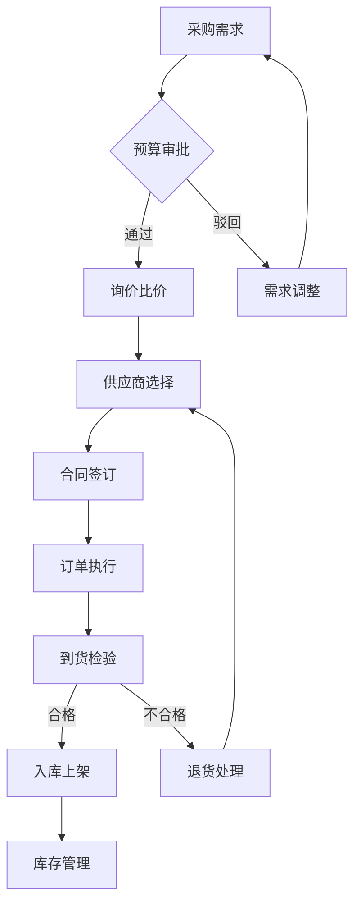
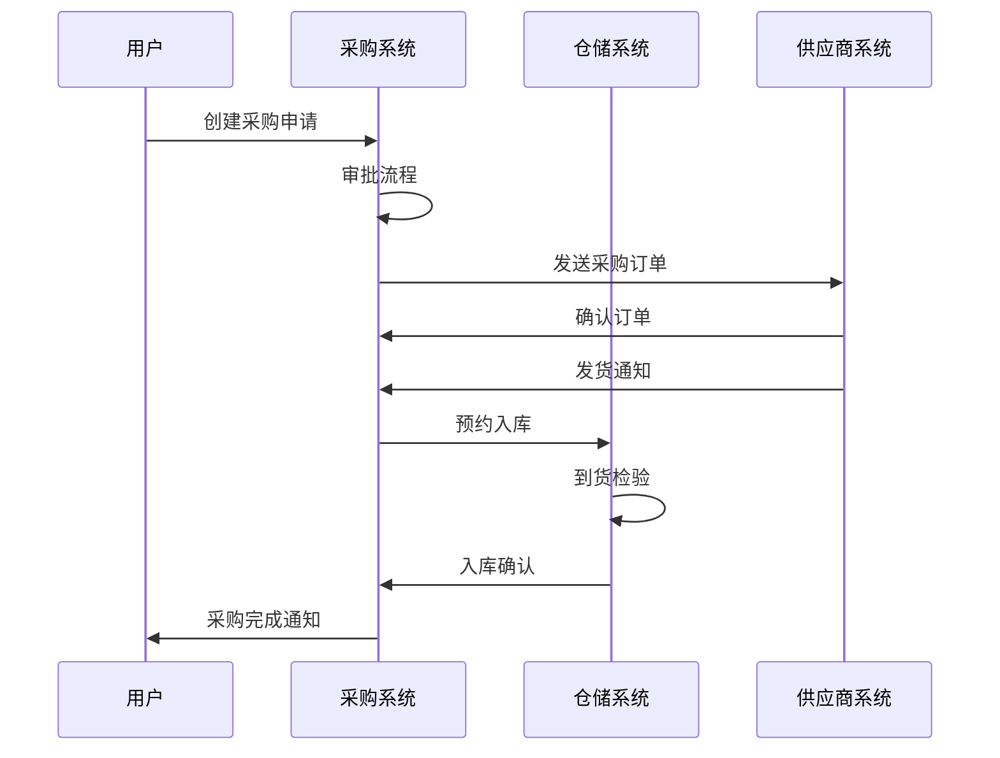
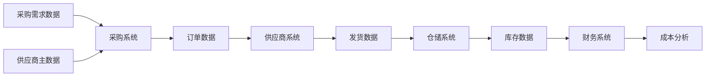
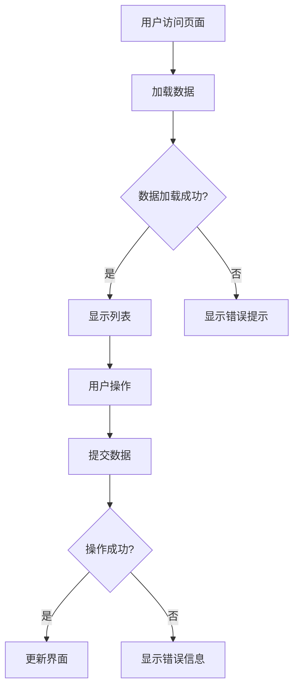
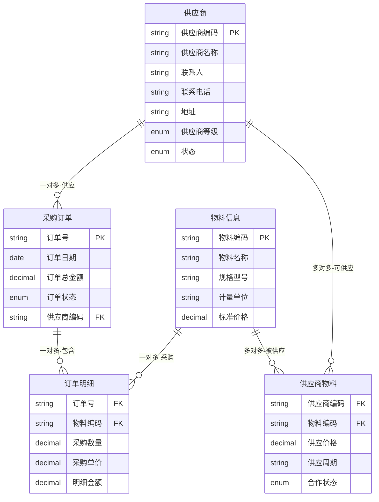

# B端供应链PRD模板

本文档提供标准的B端供应链产品需求文档模板，确保PRD文档的结构完整、内容规范。

## 模板使用说明

本模板适用于B端供应链管理系统的产品需求文档撰写，包括采购、库存、物流、供应商管理等核心业务场景。

### 使用原则

1. **完整性**：按照模板结构完整填写各章节内容
2. **准确性**：使用供应链专业术语，描述准确无歧义
3. **可执行性**：确保开发、设计、测试团队能理解和执行
4. **业务导向**：专注业务价值和用户体验，不涉及技术实现细节

---

# 供应链系统PRD：[系统名称]-[功能模块] V1.0

## 1. 版本迭代规划

| 版本 | 时间 | 核心功能 | 业务价值 |
|------|------|----------|----------|
| V1.0 | 2周  | [功能1]  | [价值1]  |
| V1.1 | 3周  | [功能2]  | [价值2]  |
| V1.2 | 2周  | [功能3]  | [价值3]  |

**说明**：
- 版本号采用语义化版本控制
- 时间为预估工作量，包括开发、测试、上线
- 核心功能应具体明确
- 业务价值应可量化

---

## 2. 业务背景与目标

### 2.1 项目背景

- 当前供应链管理面临的核心挑战
- 行业发展趋势和竞争环境分析
- 业务发展瓶颈和亟需解决的问题
- 项目启动的关键驱动因素

**示例**：
- 当前供应商信息分散在各个Excel表格中，查询困难，信息更新不及时
- 采购询价主要通过邮件和电话，效率低下，价格对比复杂
- 缺乏统一的供应商评估标准，质量管控存在风险
- 业务量增长30%，现有人工流程已无法满足效率要求

### 2.2 核心用户与场景

| 角色 | 职责 | 使用场景 | 关键痛点 |
|------|------|----------|----------|
| 采购专员 | 供应商管理、订单执行 | 供应商评估、采购下单 | 供应商信息分散、询价效率低 |
| 仓储主管 | 库存管理、收发货 | 入库验收、库存盘点 | 库存数据不准确、盘点繁琐 |
| 物流专员 | 运输协调、物流跟踪 | 运输安排、货物跟踪 | 物流信息滞后、异常处理难 |
| 财务专员 | 对账结算、成本核算 | 采购对账、费用结算 | 对账效率低、数据不准确 |
| 供应商 | 订单接收、发货管理 | 订单确认、发货通知 | 信息不透明、沟通成本高 |

### 2.3 业务目标

- **效率提升目标**：采购周期缩短30%、库存周转率提升25%
- **成本控制目标**：采购成本降低15%、库存成本减少20%
- **质量改善目标**：供应商合规率达95%、库存准确率达99%
- **协同优化目标**：供应链响应速度提升40%、异常处理时间减少50%

**说明**：
- 目标应具体可衡量
- 需要明确基准值和目标值
- 包含时间维度

---

## 3. 业务名词

| 业务名词 | 名词说明 | 应用场景 |
|----------|----------|----------|
| 采购订单 | 采购部门向供应商发出的正式采购凭证 | 物料采购、服务采购 |
| 供应商评级 | 基于质量、交期、价格、服务等维度的供应商综合评分 | 供应商准入、绩效考核 |
| 库存周转率 | 一定时期内库存物料的周转次数，反映库存管理效率 | 库存优化、成本控制 |
| 安全库存 | 为防止缺货而保持的最低库存量 | 库存计划、风险控制 |
| 到货检验 | 对供应商交付物料的质量、数量、规格进行确认 | 入库管理、质量控制 |
| 物流单据 | 包含运单、配送单、签收单等物流相关凭证 | 物流跟踪、对账结算 |
| ABC分类 | 按价值重要性将物料分为A、B、C三类的管理方法 | 库存分类、采购策略 |
| 供应链协同 | 供应链各环节间的信息共享和业务协作 | 订单协同、库存协同 |

**说明**：
- 包含所有关键业务术语
- 提供准确的定义和应用场景
- 保持术语使用的一致性

---

## 4. 流程图

### 4.1 业务流程图

**流程说明**：

1. **需求发起**：业务部门提交采购需求，包含物料规格、数量、交期等信息
2. **预算审批**：财务部门审核预算额度，确认采购资金来源
3. **供应商选择**：通过询价比价选择最优供应商，考虑价格、质量、交期等因素
4. **订单执行**：签订采购合同，跟踪订单执行进度
5. **质量控制**：到货后进行质量检验，确保符合要求
6. **库存管理**：合格物料入库，进入库存管理体系

### 4.2 系统流程图

**系统流程说明**：

1. **采购申请**：用户在系统中录入采购需求，自动路由至相关审批人
2. **订单下达**：审批通过后系统自动生成采购订单，推送给供应商
3. **协同跟踪**：供应商系统接收订单并反馈执行状态
4. **库存集成**：与仓储系统集成，实现从采购到入库的全程跟踪

### 4.3 数据流程图

**数据流向说明**：

1. **主数据管理**：统一维护供应商、物料、价格等主数据
2. **交易数据流转**：采购订单、发货单、入库单等业务数据在各系统间流转
3. **数据分析应用**：基于业务数据进行成本分析、绩效评估等

---

## 5. 功能需求详述与界面设计

### 5.1 [功能模块名]

**功能概述**：[功能的整体描述和业务价值]

**用户故事**：作为[角色]，我希望[功能]，以便于[价值]

**页面布局**：

> 📋 **提示**：粘贴页面原型图

**界面及交互说明**：

#### 5.1.1 页面说明

用户登录系统BU - 供应商平台，点击一级菜单供应商管理 --- 二级菜单供应商列表 --- 三级菜单进入该列表页

#### 5.1.2 筛选查询区

| 字段名称 | 组件 | 提示文本 | 字段说明 |
|----------|------|----------|----------|
| 供应商名称 | 输入框 | 请输入 | 1. 支持模糊查询 2. 最少输入2个字符 |
| 供应商类型 | 下拉列表 | 请选择 | 1. 数据源：供应商类型字典 2. 支持全部/多选 |
| 合作状态 | 下拉列表 | 请选择 | 1. 数据值：合作中、暂停、终止 2. 默认：全部 |
| 创建时间 | 日期范围 | 请选择 | 1. 支持快捷选项：今天、本周、本月 2. 支持自定义日期范围 |

#### 5.1.3 列表字段说明

| 字段名称 | 字段说明 |
|----------|----------|
| 供应商编码 | 系统自动生成，格式：SUP + 8位流水号 |
| 供应商名称 | 供应商全称，必填，最多100字符 |
| 联系人 | 主要联系人姓名，必填 |
| 联系电话 | 联系人手机号，必填，格式校验 |
| 供应商评级 | A/B/C/D四个等级，系统自动计算 |
| 合作状态 | 合作中、暂停、终止 |
| 创建时间 | 供应商创建的时间 |

#### 5.1.4 列表操作说明

| 操作项 | 说明 |
|--------|------|
| 新增 | 1. 点击【新增】按钮 2. 弹出新增表单 3. 填写必填项后提交 4. 校验通过后保存，状态为待审核 |
| 编辑 | 1. 点击列表行的【编辑】按钮 2. 弹出编辑表单，回显当前数据 3. 修改后提交，重新进入审核流程 |
| 删除 | 1. 点击【删除】按钮 2. 弹出确认提示 3. 确认后逻辑删除（软删除） |
| 查看详情 | 1. 点击供应商名称或【详情】按钮 2. 跳转到详情页，显示完整信息 |
| 导出 | 1. 点击【导出】按钮 2. 导出当前筛选条件下的数据 3. 格式：Excel，字段同列表 |

**业务规则**：

- **数据验证规则**
  - 供应商编码：系统自动生成，全局唯一
  - 供应商名称：必填，长度2-100字符，不可重复
  - 联系电话：必填，手机号格式校验
  - 邮箱地址：选填，邮箱格式校验

- **权限控制规则**
  - 普通用户：只能查看自己负责的供应商
  - 采购专员：可新增、编辑、查看
  - 采购主管：可审核、删除、导出
  - 系统管理员：拥有全部权限

- **状态流转规则**
  - 新建 → 待审核：提交新增表单后
  - 待审核 → 审核通过：主管审核通过
  - 待审核 → 审核驳回：主管审核不通过
  - 审核通过 → 合作中：签订合同后
  - 合作中 → 暂停：出现质量问题或其他原因
  - 暂停 → 合作中：问题解决后恢复
  - 合作中/暂停 → 终止：终止合作关系

- **异常处理规则**
  - 网络异常：显示离线缓存数据，提示网络异常
  - 数据加载失败：显示错误提示，提供重试按钮
  - 操作失败：显示具体错误信息，不关闭表单
  - 并发冲突：提示数据已被他人修改，刷新后重试

**验收标准**：

| 验收项目 | 验收标准 | 测试方法 |
|----------|----------|----------|
| 功能完整性 | 所有用户故事场景正常运行 | 手工测试+自动化测试 |
| 性能要求 | 页面加载时间<2秒，操作响应<1秒 | 性能测试工具验证 |
| 兼容性 | 支持Chrome、Firefox、Safari主流浏览器 | 跨浏览器兼容性测试 |
| 数据准确性 | 数据保存、查询、统计100%准确 | 数据对比验证 |
| 安全性 | 通过SQL注入、XSS攻击等安全测试 | 安全测试工具扫描 |

### 5.2 [另一功能模块名]

**功能概述**：[功能描述]

**交互流程**：

**交互说明**：详细描述用户在此页面的操作流程和系统响应

---

## 6. 数据模型

### 6.1 核心实体定义

| 实体名称 | 业务含义 | 核心属性 | 数据类型 | 业务约束 |
|----------|----------|----------|----------|----------|
| 供应商 | 提供物料或服务的外部组织 | 编码、名称、联系人、地址 | VARCHAR、TEXT | 编码唯一，名称必填 |
| 采购订单 | 向供应商采购的正式凭证 | 订单号、日期、金额、状态 | VARCHAR、DATE、DECIMAL | 订单号自动生成 |
| 物料信息 | 采购的商品或原材料信息 | 编码、名称、规格、单位 | VARCHAR、TEXT | 编码全局唯一 |
| 订单明细 | 采购订单的明细行项目 | 订单号、物料、数量、单价 | VARCHAR、DECIMAL | 明细金额自动计算 |
| 供应商物料 | 供应商可供应的物料关系 | 供应商、物料、价格、周期 | VARCHAR、DECIMAL | 供应价格必填 |

**说明**：
- 实体名称：使用业务术语命名
- 业务含义：准确描述实体的业务意义
- 核心属性：列出关键字段
- 数据类型：仅说明大致类型，不涉及具体数据库实现
- 业务约束：说明业务规则和约束条件

### 6.2 实体关系图

**关系类型符号说明**：
- `||--o{` : 一对多关系（1:N）
- `}o--o{` : 多对多关系（M:N）
- `||--||` : 一对一关系（1:1）
- `||--o|` : 一对零或一关系（1:0..1）

**关系说明**：
- **供应商 → 采购订单**：一对多关系，一个供应商可以有多个采购订单
- **采购订单 → 订单明细**：一对多关系，一个订单包含多个明细行
- **物料信息 → 订单明细**：一对多关系，一种物料可以出现在多个订单中
- **供应商 ↔ 物料信息**：多对多关系，通过供应商物料表关联，记录供应关系和价格信息

---

## 7. 验收标准

| 功能模块 | 验收场景 | 验收标准 | 测试数据 |
|----------|----------|----------|----------|
| 供应商管理 | 新增供应商 | 信息保存成功，状态为待审核 | 完整供应商信息 |
| 供应商管理 | 编辑供应商 | 信息更新成功，重新进入审核 | 修改部分字段 |
| 供应商管理 | 删除供应商 | 逻辑删除成功，列表不再显示 | 已有供应商记录 |
| 采购下单 | 创建采购订单 | 订单生成，推送供应商 | 标准采购申请 |
| 采购下单 | 订单审批 | 审批流程正常，状态正确流转 | 待审批订单 |
| 库存入库 | 物料入库操作 | 库存数量准确更新 | 入库单据数据 |
| 库存入库 | 质量检验 | 不合格物料正确处理 | 质检不合格数据 |

**说明**：
- 功能模块：对应第5章的功能模块
- 验收场景：具体的测试场景
- 验收标准：明确的验收通过标准
- 测试数据：需要准备的测试数据

---

## 附录：填写指南

### 必填章节

1. 版本迭代规划
2. 业务背景与目标
3. 业务名词
4. 流程图
5. 功能需求详述与界面设计
6. 数据模型
7. 验收标准

### 可选章节

根据实际情况可添加：
- 技术约束
- 上线计划
- 风险评估
- 培训计划

### 图片使用规范

- 使用占位符标识图片位置
- 提供清晰的插入提示
- 统一使用./images/目录
- 图片文件命名清晰明确

### 格式规范

- 使用Markdown格式
- 表格内容对齐
- Mermaid图表语法正确
- 标题层级清晰

### 注意事项

1. **专注业务层面**：PRD描述业务需求，不涉及技术实现细节
2. **供应链专业性**：使用供应链行业标准术语
3. **现有系统增强**：默认基于现有系统功能增强
4. **敏捷迭代**：支持功能的原子化和渐进式交付
5. **可执行性**：确保开发、设计、测试团队能理解和执行

### 参考文档

- [供应链业务术语表](./SUPPLY_CHAIN_TERMS.md)
- [PRD评审标准](./REVIEW_CRITERIA.md)
- [完整PRD示例](./PRD_EXAMPLES.md)

---

**版本记录**：
- V1.0 (2025-10-24): 初始版本，完整PRD模板
